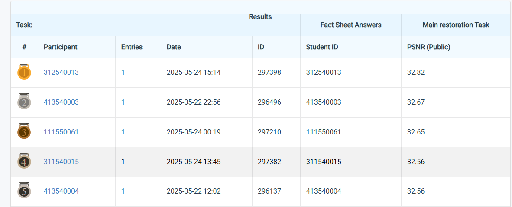

# **Selected Topics in Visual Recognition using Deep Learning HW4**
StudentID: 311540015

Name: Do Huu Phu

## **Introduction**
This README provides details on the configurable parameters for HW4 training Image Restoration (Rain and Snow) task. oth rain- and snow-degraded images are jointly used during training.

Environment Setup:

- Python version: 3.8.11

- PyTorch version: 2.0.1

```bash
conda env create -f env.yml
```

Download the dataset and store it at the same level as the repository.


## Training

To train a model using the provided parameters, you can execute `run.bash` or the script as follows:

```bash
bash train.sh
```
The train.sh file executes the command:
```bash
python train.py --de_type deall --num_gpus 1 \
--output_path output/default/all \
--ckpt_dir output/default/8len_2linear/ckpt \
--batch_size 6 --epochs 20
```

## Testing
To test the model using the provided parameters, you can execute `test.bash` or the script as follows:

```bash
bash test.sh
```


## Performance snapshot

 

